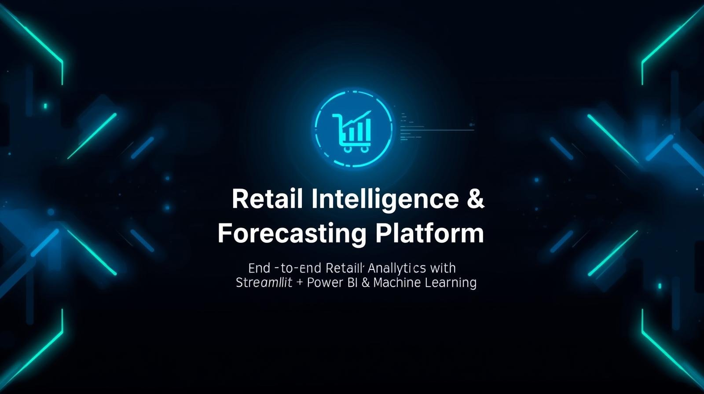

# 🛒 Retail Intelligence & Forecasting Platform  

<p align="center">
  
</p>  

## 📌 Overview  
This project is an **end-to-end data analytics and forecasting solution** for the retail & e-commerce sector.  
It demonstrates the full data lifecycle: **data engineering → SQL → Python analytics → machine learning → Power BI → business insights → Streamlit app.**  

The final output includes:  
- A **normalized database** with realistic retail data  
- **SQL queries & views** for CXO-level dashboards  
- **Python notebooks** for analytics, EDA, and forecasting  
- **Power BI dashboard** with executive-ready insights  
- **Streamlit app** for interactive exploration  
- A **business case study & portfolio deck**  

---

## 🎯 Objectives  
Turn raw e-commerce data into **actionable insights** that help businesses make decisions around:  
- 💰 **Pricing**  
- 🎁 **Promotions**  
- 📦 **Inventory management**  
- ❤️ **Customer retention**  

---

## 🗺️ Scope  
- Multi-regional sales data 🌍 (India, Dubai, Riyadh)  
- Sales & revenue analysis 📊  
- Customer segmentation & churn 👥  
- Product performance 🏆  
- Demand forecasting 📈  
- Executive-ready BI dashboards 🖥️  
- Interactive web app via Streamlit 🌐  

---

## ⚙️ Methodology  

### **Phase 1: Data Engineering & Foundation** 🏗️  
- Designed schema: Products, Customers, Orders, Payments, Inventory, Regions, Suppliers  
- Generated 10K+ rows with **Python Faker**  
- Validated with SQL queries (JOIN, GROUP BY, aggregates)  

---

### **Phase 2: Advanced SQL & ETL** 🔍  
- Used **window functions** for ranking, running totals, purchase frequency  
- Applied **CTEs** for cohort analysis, monthly growth, category trends  
- Built optimized **CXO Retail Dashboard View**  
- Indexed & partitioned for performance  

---

### **Phase 3: Python Analytics & ML** 🤖  
- Connected SQL → Python (Pandas + SQLAlchemy)  
- Performed **EDA** (sales distribution, product profitability, LTV)  
- Created **visualizations** (heatmaps, basket analysis, trendlines)  
- Forecasting with **Prophet/ARIMA**  
- Customer **churn detection**  

---

### **Phase 4: Power BI Dashboard** 📊  
Interactive executive dashboard with:  
- Revenue by region, category, time  
- Top vs underperforming products  
- Forecast vs actual sales  
- Customer churn & retention  
- Dynamic filters (region, category, time)  

📊 **Power BI Dashboard Screenshots:**  

## 📊 Dashboard Preview  

<p align="center">
  
  
  
  
  
</p>  

---

### **Phase 5: Streamlit App** 🌐  
To make the project interactive beyond Power BI, a **Streamlit app** was developed.  
- Real-time filtering of customer & sales data  
- Forecast vs actual revenue comparison  
- Customer churn insights with retention suggestions  
- Product-level profitability analysis  

Run locally with:  
- streamlit run app.py;

---

## 🛠️ Tools & Technologies

- **Database:** MySQL 🗄️  
- **Programming:** Python (Pandas, SQLAlchemy, NumPy , Seaborn , Matplotlib) 🐍  
- **Libraries:** Faker, Matplotlib, Seaborn, Scikit-learn, Prophet/Statsmodels 📚  
- **BI Tool:** Power BI 🖥️  
- **Web App:** Streamlit 🌐  
- **Version Control:** Git & GitHub 🌐  
- **Excel:** Advanced formulas, Pivot Tables, Macros, Solver  

---

## 📊 Key Insights

- **Total Revenue:** 512M  
- **Customers:** 41K (but churned 23K → losing ~598M revenue 🚨)  
- **Forecasted Revenue:** 1.09T (strong seasonal patterns)  
- **Regional Insights:** India is growth driver; GCC needs targeted expansion  
- **Product Insights:** Top 10 products dominate sales → risk of overdependence  

---
## 🚀 How to Run

1. **Clone the repo:**
```bash
git clone https://github.com/MdAjams/Retail-E-Commerce-Analytics-Forecasting.git
cd Retail-Intelligence-Forecasting '''

**Setup database MySQL)**
- psql -U user -d retail_db -f Data/Schema.sql
**Generate sample data:**
- python Data/DataGeneration.py
**Launch Streamlit app:**
- streamlit run Streamlit_App/app.py
## 🌟 Future Enhancements

**Integrate with real-world e-commerce datasets**

**Deploy forecasting model as an API**

**Add interactive dashboards with Plotly/Dash**

**Use deep learning for advanced demand forecasting**
